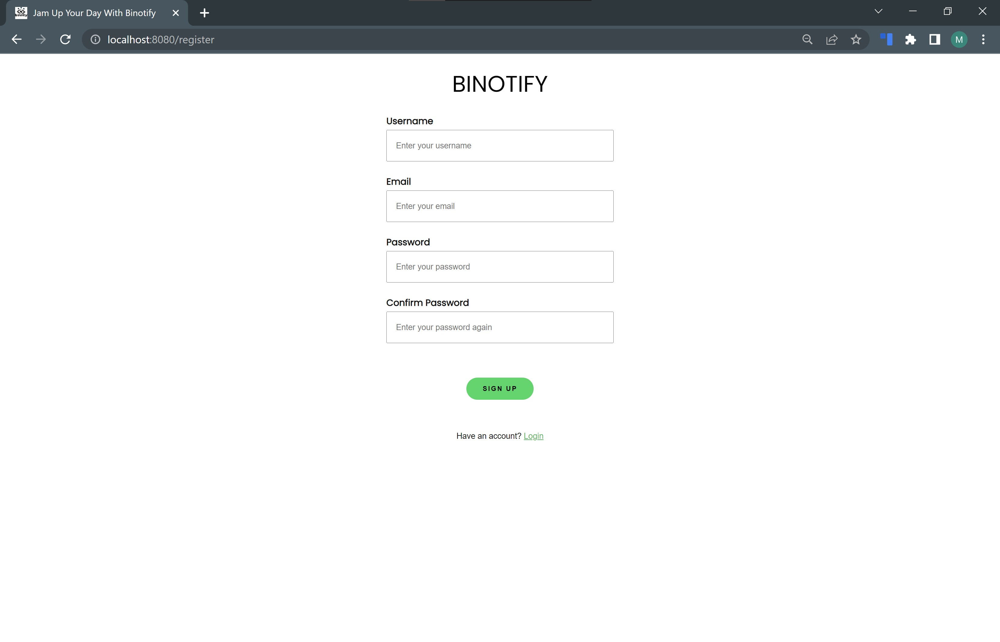

# Website Pemutar Lagu Binotify - Monolithic PHP & Vanilla Web Application

## Daftar Isi
- [Deskripsi](#deskripsi)
- [Requirements](#requirements)
- [Cara instalasi](#cara-instalasi)
- [Cara menjalankan server](#cara-menjalankan-server)
- [Screenshot](#screenshot)
- [Pembagian tugas](#pembagian-tugas)
- [Perubahan Yang Dilakukan](#perubahan-yang-dilakukan)

## Deskripsi
Wesbite binotify merupakan sebuah website pemutar lagu yang dibuat menggunakan bahasa pemrograman PHP sebagai backend dan HTML, CSS, Javascript sebagai frontend. Website ini dibuat tanpa menggunakan framework. Website ini dapat melakukan login dan register sebagai pengguna biasa. Pengguna terbagi menjadi tiga, yaitu pengguna yang terautentikasi, admin, dan pengguna yang tidak terautentikasi. Ketika masuk sebagai admin, maka website akan menampilkan beberapa menu yang hanya bisa diakses oleh admin seperti daftar users, tambah lagu/album, dan edit lagu/album. Perbedaan antara pengguna yang terautentikasi dan tidak terautentikasi adalah pengguna yang tidak terautentikasi hanya bisa memainkan lagu sebanyak 3 kali per hari. Selain itu, website memiliki fitur untuk melihat detail album/lagu, mencari lagu berdasarkan judul, penyanyi, dan tahun, melakukan sortir berdasarkan judul serta melakukan filter berdasarkan genre.

## Requirements
1. Extension PDO_mysql dan mysqli untuk PHP aktif
2. PHP >= 7.2
3. Docker >= 3.8
4. MySQL >= 8.0

## Cara instalasi
1. Download PHP dari website resmi PHP
2. Ikuti panduan instalasi PHP
3. Download MySQL dari website resmi MySQL
4. Ikuti panduan instalasi MySQL
5. Aktifkan extension PDO_mysql dan mysqli untuk PHP dengan cara pindah ke folder tempat Anda menginstall PHP. Buat file php.ini. Tambahkan line berikut:
```
extension=pdo_mysql
extension=mysqli
```
6. Jika ingin install Docker, silahkan download Docker dari website resmi Docker. Kemudian ikut panduan instalasinya.

## Cara menjalankan server
### Panduan menjalankan server tanpa Docker
1. Install dan setup database Anda
2. Ubah variabel database sesuai setup yang sudah Anda lakukan di folder `src/app/config/config.php`
3. Buka terminal
4. Import base.sql dari scripts/db ke database Anda dengan command `mysql -u username -p database_name < base.sql`
5. Pindah ke direktori src/public
6. Jalankan php dengan `php -S localhost:8080`

### Panduan menjalankan server dengan Docker
1. Jalankan docker
2. Buka terminal pada folder tempat Anda clone repo ini
3. Jalankan perintah `docker-compose up --build`

## Screenshot
1. Halaman Login


2. Halaman Register


3. Halaman Home User


4. Halaman Home Admin


5. Halaman Daftar Album


6. Halaman Daftar User


7. Halaman Search


8. Halaman Edit Lagu


9. Halaman Edit Album


10. Halaman Tambah Lagu


11. Halaman Tambah Album


12. Halaman Detail Lagu


13. Halaman Detail Album

## Pembagian tugas
### Server side
- Login: 13520096
- Register: 13520096, 13520049
- Home: 13520096
- Daftar Album: 13520049
- Search, sort, filter: 13520049
- Detail Album: 13520129, 13520049
- Detail lagu: 13520129
- Daftar Users: 13520049
- Tambah Album/Lagu: 13520129

### Client side
- Login: 13520096
- Register: 13520096
- Home: 13520096
- Daftar Album: 13520049
- Search, sort, filter: 13520049
- Detail Album: 13520129, 13520049
- Detail lagu: 13520129
- Daftar Users: 13520049
- Tambah Album/Lagu: 13520129

## Perubahan Yang Dilakukan
### Perubahan
1. Perubahan Database
Penambahan tabel subscription yang merupakan “duplikasi” dari tabel di service SOAP untuk mengetahui status subscription pengguna tanpa perlu melakukan request apakah pengguna sudah subscribe atau belum. Data dari tabel ini akan berisi data yang dikirim via callback endpoint.
2. Halaman List Penyanyi Premium
Halaman ini menampilkan daftar penyanyi yang menyediakan lagu premium. Halaman ini memanfaatkan endpoint dari sercive REST.
3. Halaman List Lagu Premium
Halaman ini menampilkan daftar lagu premium dari penyanyi yang telah di-subscribe oleh pengguna. Halaman ini akan memanfaatkan endpoint dari service REST.
4. Endpoint Callback'
Endpoint callback dari service SOAP menerima field yang sesuai dengan tabel subscription.


### Pembagian Tugas
#### Server Side
- Penyanyi Premium: 1320049
- Lagu Premium: 13520096
- Endpoint Callback: 13520049

#### Client Side
- Penyanyi Premium: 1320096
- Lagu Premium: 13520096

### Screenshot
1. Halaman penyanyi premium

2. Halaman lagu premium


## Author
- 13520049 - Aditya Prawira Nugroho
- 13520096 - Monica Adelia
- 13520129 - Nathanael Santoso
